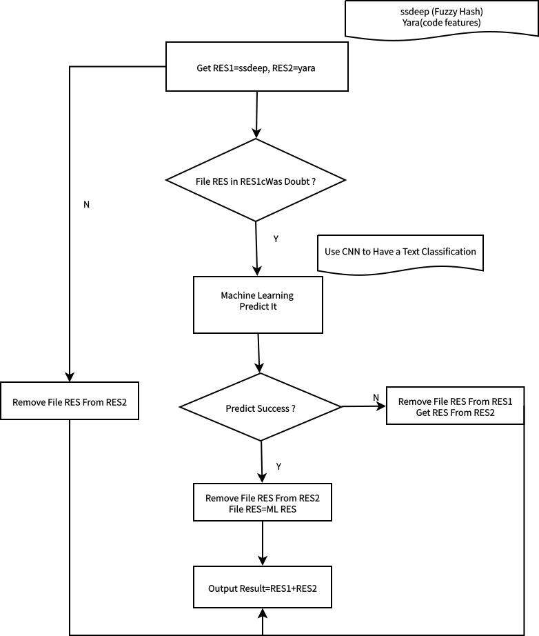

## webshell的检测

### 检测方法通常有

* 基于日志,行为,流量
* 基于Machine Learning ,Fuzzy Hash, Code Features

### 此处初期选择采用以下方法

* 文件 hash 比较以及 fuzzy hash ([已知文件|未知文件]) (ssdeep)
* 代码特征值，危险函数检测 (yara)
* 机器学习，分类 [CNN-Text-Classfication](https://github.com/dennybritz/cnn-text-classification-tf/)

### Other

Also Include A CLI, Flask As Web Server

`curl -i -X PUT -F filedata=@1.php "http://localhost:5000/detect"`

### To do

* Write Unit Test,Mock Test
* Write Yara Rule
* GAN ? Important
(Mei you zhong wen shu ru fa de jie guo...)

